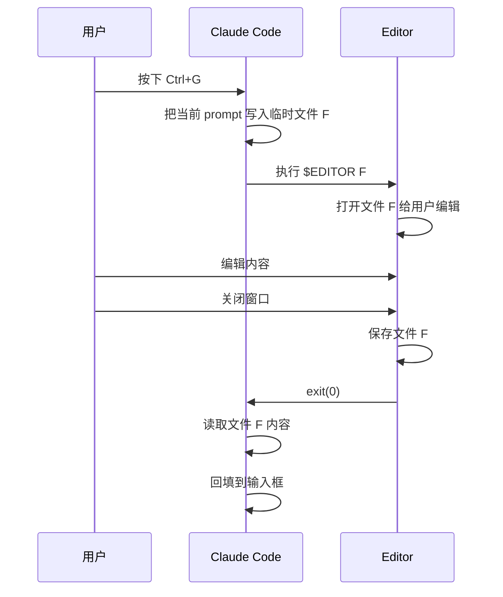

# Claude Code 外部编辑器原理

## 概述

Claude Code 的 `Ctrl+G` 触发外部编辑器编辑当前输入框内容：

1. 按键被 TUI 捕获
2. 把文本写到临时文件
3. 启动编辑器进程编辑该文件
4. 等待编辑器退出
5. 读取文件内容回填输入框

## 核心流程

```
Claude Code                    Editor
    |                            |
    |--- spawn "editor <file>" ->|
    |                            | (窗口打开，用户编辑)
    |      (阻塞等待进程退出)      |
    |                            | (用户关闭窗口)
    |<---- 进程退出 exit(0) ------|
    |
    | 读取文件内容，回填输入框
```

## 编辑器要满足的契约

Claude Code 执行：
```bash
$EDITOR /path/to/tmp_prompt.txt
```

编辑器需要：
- **输入**: 从命令行参数获取文件路径
- **输出**: 把最终文本写回同一路径
- **阻塞**: 进程在编辑完成前必须一直运行
- **退出码**:
  - `exit 0`: 确认完成
  - `exit 1`: 取消
  - `exit >=2`: 错误

## 保存要求

Claude Code 在进程退出后立刻读取文件，必须确保：
- 所有编辑已写回文件
- 写入已 flush（close 文件句柄）
- 建议使用原子写入：写到 `.tmp` → fsync → rename

## 流程图


